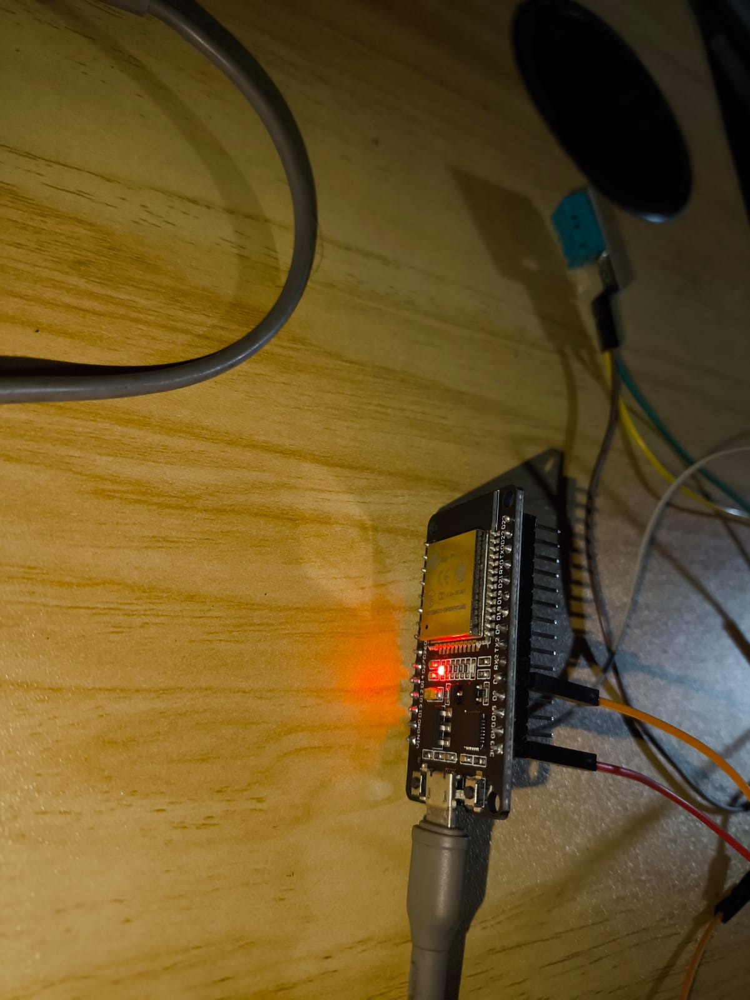

# Tech Assignment - week 4
Saya menggunakan Sensor DHT11 (Temprature & Humidity) sebagai sensor temperatur, ESP32 adalah microcontroler yang terhubung dengan DHT11 
- [sketch.ino](ProgramArduino/sketch.ino) files untuk mengambil 1 buah data sensor dan mengirimkannya ke local server melalui HTTP REST API ( POST Method )
- [server.py](Server/server.py) files untuk menerima data REST API dan menampilkanya di server

## Data Diri
|                     |                                  |
|---------------------|----------------------------------|
| **Nama**            | Amelia Joy Angelita Simorangkir  |
| **Tim**             | Group 1                          |
| **Asal Sekolah**    | Politeknik Negeri Jakarta        |

## Alat
- ESP32
- Sensor DHT11 (Tempratur dan Kelembaban)
- Kabel Jumper

## Pin ESP32 TO SENSOR
| ESP32 | Sensor DHT11       |
|----------------|------------------|
| 5V / 3V| + |
| GND | - |
| 4 | OUT |

## Cara Penggunaan

1. **Rangkaian Fisik**: Hubungkan DHT11 ke microcontroller ESP32
    

2. **Program Arduino**: Jalankan sketch `sketch.ino` dengan Arduino IDE. Pastikan anda mengubah
   - DHTPIN isi sesuai pin pada rangkaian
   - ssid = "Nama wifi Anda"
   - password = "Password wifi Anda"
   - serverName = "http://localhost:5000/sensor/data"

4. **Flask Python**: Jalankan script `server.py` agar server dapat menerima data dari ESP32 dan mengirimkan ke local server.

5. **Membuka tampilan di server**: Buka browser `http://localhost:5000/dashboard` untuk melihat output. server akan menampilkan suhu dan kelembapan.
